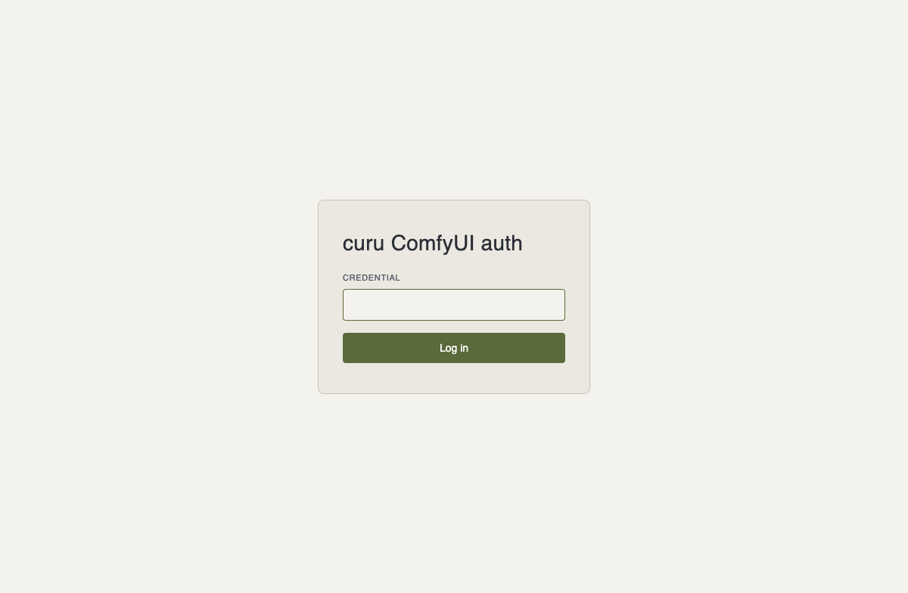
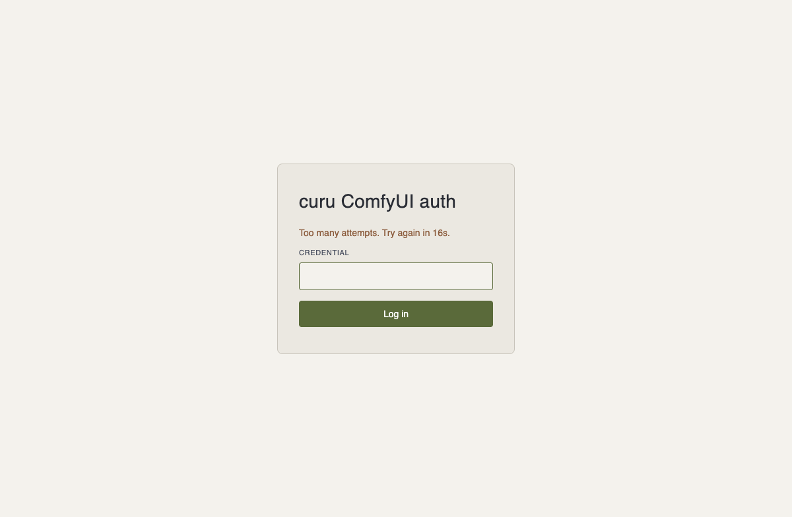

# comfyui_curu_auth

## What is this

A ComfyUI custom node that puts a bearer-token credential in front of your
whole ComfyUI backend — every route, including the `/ws` connection its
progress streaming depends on. No accounts, no config file, no external
service: install it, restart ComfyUI, and it prints a fresh credential to
the console. That's the whole setup.



## Install

```bash
cd /path/to/ComfyUI/custom_nodes
git clone https://github.com/darth-veitcher/comfyui_curu_auth
```

## Quickstart

Restart ComfyUI:

```
comfyui-curu-auth gate active. Credential:
  Yx3fQvR8...
```

Use that credential two ways:

- **Automated clients** — send `Authorization: Bearer <credential>` with every request.
- **A real browser** — open ComfyUI's own UI directly and paste the credential into the login form the gate serves at `/curu-auth/login`. A `HttpOnly` / `Secure` / `SameSite=Strict` cookie carries the session from there (30 days); the credential itself is never transmitted a second time.

There's no way to fetch the credential over the network — it only ever
prints to the console. That's deliberate: no automated credential
exchange means no new attack surface for one.

## Pin a credential instead of a fresh one every restart

```bash
export COMFYUI_CURU_AUTH_TOKEN="$(python3 -c 'import secrets; print(secrets.token_urlsafe(32))')"
```

Set it however you start ComfyUI — shell export, a systemd unit's
`Environment=`, a `docker-compose.yml` `environment:` entry. Unset (the
default) keeps a fresh random credential every restart.

## Optional: log in through your own identity provider

```bash
export COMFYUI_CURU_AUTH_OIDC_ISSUER_URL="https://your-idp.example.com"
export COMFYUI_CURU_AUTH_OIDC_CLIENT_ID="comfyui-curu-auth"
export COMFYUI_CURU_AUTH_OIDC_CLIENT_SECRET="<registered client secret>"
export COMFYUI_CURU_AUTH_OIDC_REDIRECT_URI="https://your-comfyui-host/curu-auth/oidc/callback"
```

All four are optional, but MUST be set together — any subset (e.g. an
issuer URL with no client secret) is treated exactly like none at all:
ComfyUI starts with no OIDC routes and no OIDC option on the login page,
same as today. Set all four and restart, and the login page offers "Log
in with your identity provider" alongside the existing credential field
— a successful login there lands you in the same `curu_auth` session
cookie the credential-based form already sets. The Bearer-header path for
automated clients is unaffected either way.

See [`specs/002-oidc-login/quickstart.md`](specs/002-oidc-login/quickstart.md)
for a full walkthrough, including running the live suite against a real
Authelia instance.

## Repeated failures back off — on every path



Wrong credential enough times in a row, from either the login form or the
Bearer-header path automated clients use, and that client gets `429` with
a growing `Retry-After` (1s → 2s → 4s → ... capped at 5 minutes),
resetting on a correct attempt. The login page's own countdown updates
live client-side — no refreshing to see if you can try again yet.

The credential itself (256 bits of entropy) is already computationally
infeasible to brute-force — this bounds the noise a scanner can generate
against either path, nothing more. An already-established browser session
is never affected by backoff accrued elsewhere.

## Blocking repeat offenders at the firewall

Every rejected request also writes one stable, greppable log line:

```
comfyui_curu_auth: authentication failure from 203.0.113.7 (GET /object_info)
comfyui_curu_auth: authentication failure from 203.0.113.7 (login form)
comfyui_curu_auth: authentication failure from 203.0.113.7 (oidc callback)
```

Ready-to-install fail2ban and crowdsec config, plus step-by-step
install instructions for each, live in
[`contrib/`](contrib/README.md).

## How it works

This node reaches into ComfyUI's own already-running
`server.PromptServer.instance.app` at import time and appends one
`aiohttp` middleware to it. Because ComfyUI registers every route onto
that same `app`, one middleware covers all of them, including the `/ws`
websocket handshake — verified directly against ComfyUI's own `server.py`.

The credential is `secrets.token_urlsafe(32)`, checked with
`secrets.compare_digest` (constant-time). No custom node classes are
registered and this extension serves no JS of its own beyond the login
page's own inline countdown script — it's a server-side-only gate.

## Tests

```bash
uv sync
uv run pytest
```

`gate.py`'s logic (credential generation, the middleware, sessions, rate
limiting) runs against a real, minimal `aiohttp.web.Application` via
`aiohttp.test_utils` — no ComfyUI installation needed.

`__init__.py` itself (the real ComfyUI-side wiring) has its own opt-in,
live test suite instead of only a by-hand check:

```bash
uv run pytest -m system
```

Brings up a real, CPU-only ComfyUI instance in Docker (this repo's own
working tree installed as the custom node — see
[`specs/001-docker-comfyui-harness/quickstart.md`](specs/001-docker-comfyui-harness/quickstart.md))
and verifies the gate against it directly: unauthenticated rejection on
HTTP routes and the `/ws` handshake, correct-credential success, rate-limit
backoff, and clean teardown/restart. Never runs as part of the plain
`uv run pytest` above — opt-in only, and no GPU/rendering involved.

## Origin

Extracted from [curu](https://github.com/darth-veitcher/curu)'s own
`local-network-auth-and-encryption` epic, where this gate's credential
scheme was originally designed to harmonise with curu's own
control-plane API — reused here standalone, not re-derived.

## License

MIT — see [LICENSE](LICENSE).
