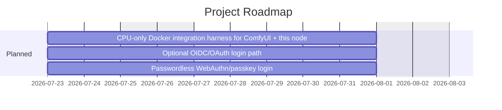

# comfyui_curu_auth — Roadmap

<!-- generated by beacon roadmap export — 2026-07-23 -->

> By year-end, this is the default answer to "how do I put a password on ComfyUI" for self-hosted and rented-GPU users — zero-config bearer-token install, every route covered including websockets, fail2ban/crowdsec ready for public-IP deployments. From there, we expand who gets to authenticate: OIDC/OAuth for teams with an existing identity provider, and passkeys/WebAuthn for a passwordless, phishing-resistant flow — added as options alongside the credential model, not replacing its zero-config simplicity for solo/home users.

## Timeline

## Epics

| Epic | Title | Status | Specs | Fidelity |
|---|---|---|---|---|
| [local-test-harness](project-management/Roadmap/epics/local-test-harness.md) | CPU-only Docker integration harness for ComfyUI + this node | Planning | — | S? A? T:- |
| [oidc-auth](project-management/Roadmap/epics/oidc-auth.md) | Optional OIDC/OAuth login path | Planning | — | S? A? T:- |
| [passkey-auth](project-management/Roadmap/epics/passkey-auth.md) | Passwordless WebAuthn/passkey login | Planning | — | S? A? T:- |

_Fidelity: `S+/S?` = has specs / none · `A+/A?` = has ADRs / none · `T:N%` = task completion_

## Active Work

_No active bullets._
