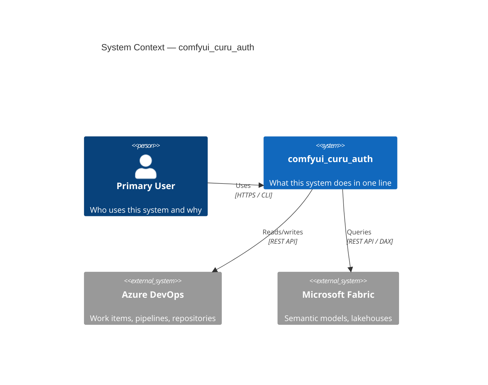
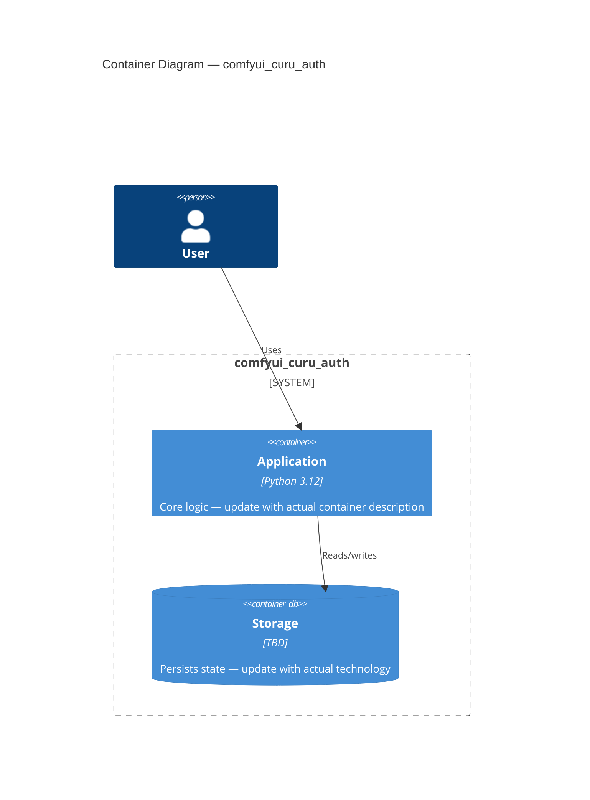
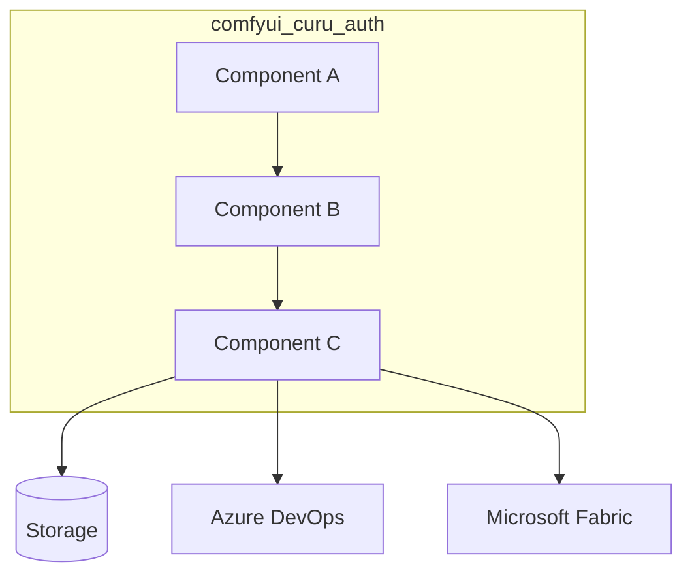
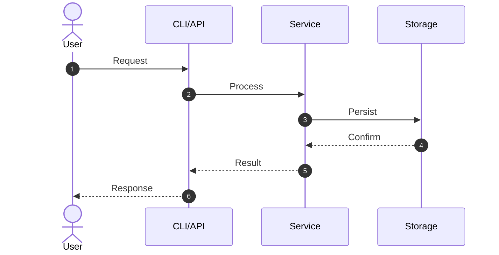
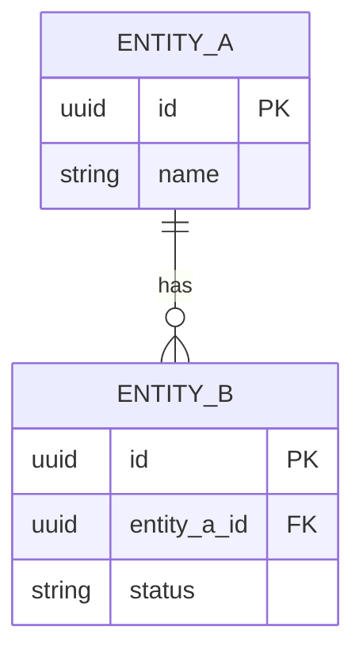
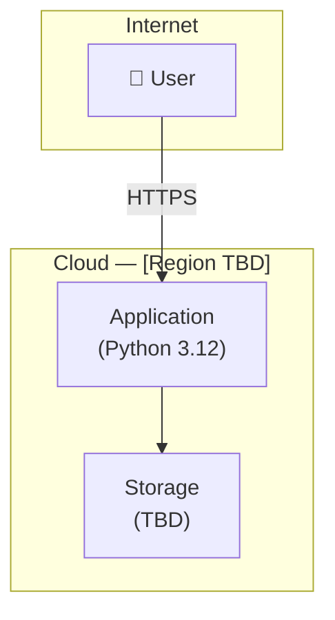

# Architecture Document

<!--
BEACON DESIGN phase deliverable. Update when a new ADR affects the architecture.
Always link to the relevant ADR rather than duplicating rationale here.
Use /design:diagram <component> to generate or regenerate any diagram below.
-->

## Overview

[High-level description of the system — what it does and how its major parts relate]

---

## C4 Context: System in its Environment

*What to update:* Replace external systems with the ones that actually apply. Remove
`ado`/`fabric` if not used. Add any third-party APIs, auth providers, or data sources.

---

## C4 Container: Deployable Units

*What to update:* Add containers as the architecture is decided. Link each container to
its ADR when a technology choice was made.

---

## System Components (logical view)

---

## Technology Stack

| Layer | Technology | Rationale | ADR |
|-------|-----------|-----------|-----|
| Language | Python 3.12 | — | — |
| Package manager | uv | Speed, lockfiles, workspace support | — |
| Linter/formatter | Ruff | Single tool, fast, replaces flake8+black+isort | — |
| Type checking | ty | Astral native type checker, replaces mypy | — |
| Azure integration | Azure CLI + MCP | See `.claude/settings.json` | — |

---

## Data Flow: Primary Path

---

## Data Model (ERD)

---

## Deployment Topology

*What to update:* Replace with actual cloud provider, region, and services once the
deployment architecture is decided (link to ADR).

---

## Interface Contracts

[API endpoints, CLI commands, or integration contracts that must remain stable once shipped]

---

## Non-Functional Requirements

- **Performance:** [targets — latency p99, throughput]
- **Security:** [requirements — auth, data sensitivity, never commit secrets, use `.env`]
- **Scalability:** [approach]
- **Observability:** [logging strategy, tracing, alerting]

---

## Tracer Bullet Decomposition

| Phase | Bullets | Outcome |
|-------|---------|---------|
| Foundation | 1–2 | Core plumbing proven end-to-end |
| Core logic | 3–5 | Business rules implemented |
| Integration | 6–7 | Azure DevOps + Fabric wired up |
| Production | 8+ | Deployment, observability, polish |

---

_Created:_ 2026-07-23
_Last updated:_ 2026-07-23 — BEACON SEED phase: project name stamped
_Status:_ Living document — update when ADRs change the architecture
